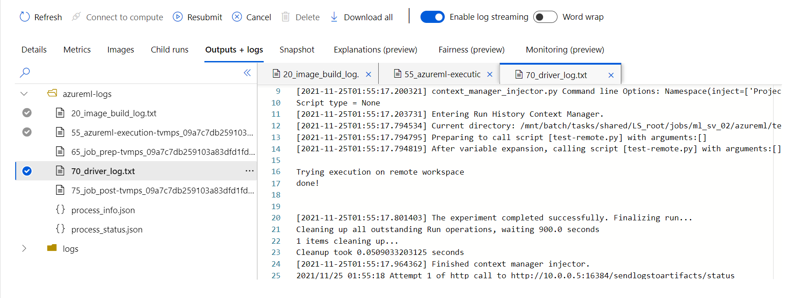
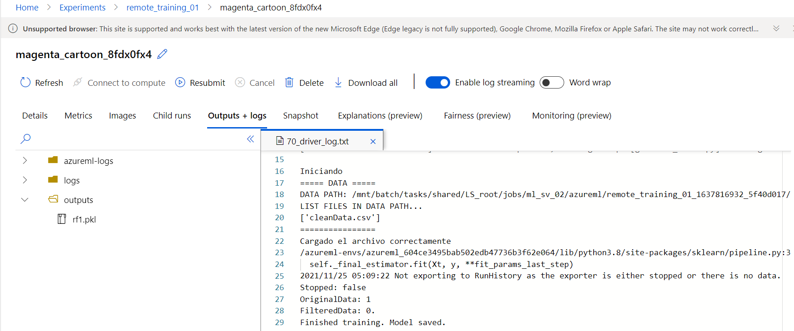
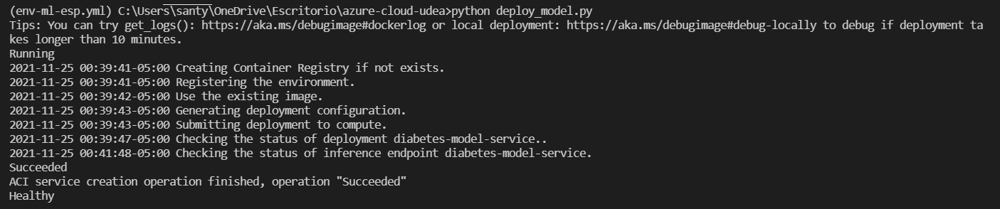
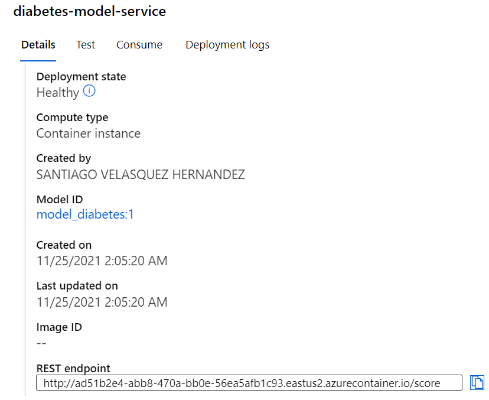
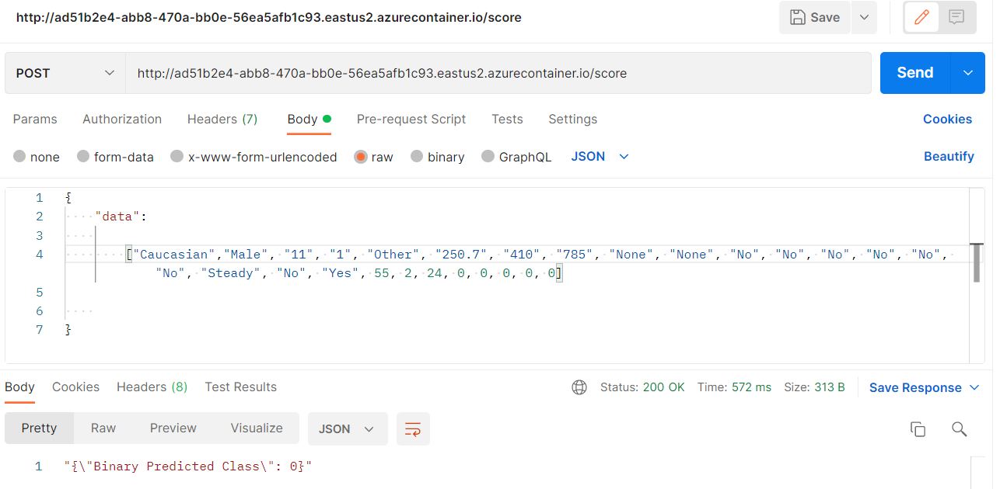

# Entrenamiento y despliegue de modelo en AzureML

_Aplicación final Cloud - Especialización Analítica UdeA - Semestre 2 / 2021_

**Santiago Velásquez**

1036647710

_santiago.velasquez4@udea.edu.co_

**Carolina González Marín**

1017251647

_carolina.gonzalezm1@udea.edu.co_

## Comenzando 🚀

_Estas instrucciones/informe muestran cómo llevar de 0 a 1 la configuración, entrenamiento y despliegue de un modelo de machine learning en Azure._


### Configuración 🔧 

1. Tener una cuenta activa de Azure. Se puede realizar a través del [Azure Portal](www.portal.azure.com)

2. Instalar lo necesario utilizando el archivo _.azureml/env-ml-esp.yml_. Si se está utilizando conda como el administrador de ambientes virtuales

```
 conda env create -f .azureml/env-ml-esp.yml
 conda activate env-ml-esp.yml
```

3. Crear un Grupo Recursos. Se puede acceder al ícono de _Grupo de Recursos_ y posteriormente darle en _Crear_, arriba a la izquierda. Proveer la configuración y nombre necesaria.


4. Es hora de aprovisionar un recurso dentro del grupo de recursos. En este contexto de entrenar modelos de ML necesitaremos _Azure Machine Learning._ Puede hacerse de dos maneras.

* Manualmente aprovisionando el recurso. Dentro del Grupo de Recursos creado ir al botón _Crear_, buscar "Azure Machine Learning" y crear el recurso. (Cerciorarse de crear un nuevo _Registro de Contenedor_, esto aparece en las opciones de creación de Azure ML.)


* Utilizar el archivo _create-workspace.py_. Se deben proveer algunos detalles de suscripción, grupo recursos y nombre del recurso para Azure ML.

5. Crear una instancia/clúster de ejecución. Se debe aprovisionar este recurso en el Grupo Recurso donde se está trabajando, de manera similar a como se aprovisiona de manera manual Azure ML.

6. Validar que la configuración es correcta y que tenemos acceso al workspace de manera remota. El script _test-workspace.py_ realiza ese trabajo ejecutando _/src/test-remote.py/_. Se debe proveer un nombre de experimento y el clúster de ejecución con el que se quiere correr el experimento. Se puede comprobar las diferentes salidas de la ejecución de _test-remote_ en los logs.




### Entrenamiento 📋

1. Subir dataset al workspace con _upload-dataset.py_. Cargará lo que haya en la carpeta _/data_. En este caso hay un archivo depurado de datos asociados a readmisiones de pacientes diabéticos en los últimos 10 años en cierto hospital (tomado de Kaggle). Esto se subirá al _Almacén de Datos_ default del workspace (también conocido como blob storage)

2. Para entrenar el modelo se puede utilizar _train-with-remote.py_. Este script ejecutará un experimento con el nombre y el clúster proporcionado, y una ruta hacia los datos. En este caso será el archivo subido previamente al almacén de datos. Este script ejecutará el archivo _/src/generate-model.py_. Este script crea un pipeline de preprocesamiento y entrena un modelo Random Forest para un problema de clasificación binaria para predecir si un paciente será readmitido nuevamente por diabetes en el futuro dadas ciertas características. Finalmente escribe el pipeline + modelo en un archivo _.pkl_. 



3. Al terminar de ejecutar el entrenamiento se puede descargar el archivo _rf1.pkl_ de la carpeta _outputs_ en el entorno de ejecución del experimento.


### Despliegue ⚙️

1. Puede ubicar el modelo descargado en la carpeta _/models_ o modificar la ruta en _register-model.py_ donde tiene el modelo; también es necesario proveer el nombre que tendrá el modelo en Azure ML. En este caso es "model_diabetes". Ejecute este script.

2. Desplegar el modelo usando _deploy-model.py_. Este script utiliza otro script en el que se debe indicar cómo procesar el _request_ y qué es lo que va a devolver en la respuesta. En este caso ese script utiliza el archivo _repsonse.py_.

3. Revise en Azure ML que el despliegue haya sido correcto y que el endpoint se encuentra _Saludable_. Puede revisar esto en las dalidas de ejecución del script o en el botón _Endpoints_ en Azure ML.



4. Utilice el endpoint. En este caso es http://ecab8ca8-c9ac-461d-bdcf-3ebecd105871.eastus2.azurecontainer.io/score, también almacenado en _endpoint.txt_.




### Pruebas end-to-end 🔩

Utilice el endpoint para hacer requests y probar el despliegue y el desempeño del modelo. Puede utilizar _Postman_ para esto de la siguiente manera



