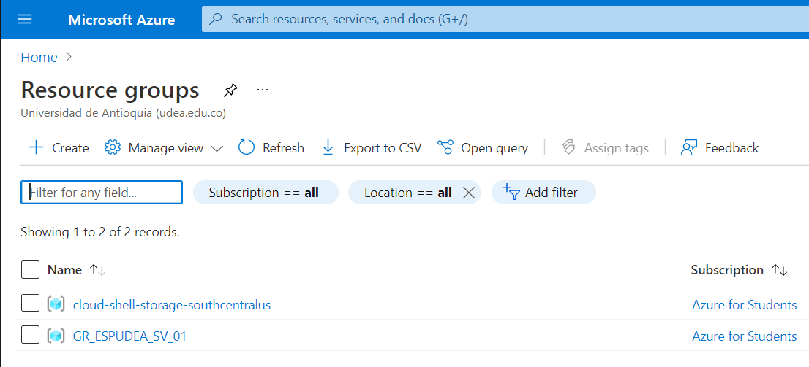

# Título del Proyecto

_Aplicación final Cloud - Especialización Analítica UdeA - Semestre 2 / 2021_

**Santiago Velásquez**

1036647710

_santiago.velasquez4@udea.edu.co_

**Carolina González Marín**

1017251647

_carolina.gonzalezm1@udea.edu.co_

## Comenzando 🚀

_Estas instrucciones/informe muestran cómo llevar de 0 a 1 la configuración, entrenamiento y despliegue de un modelo de machine learning en Azure._


### Configuración 📋

1. Tener una cuenta activa de Azure. Se puede realizar a través del [Azure Portal](www.portal.azure.com)

2. Instalar lo necesario utilizando el archivo _.azureml/env-ml-esp.yml_. Si se está utilizando conda como el administrador de ambientes virtuales
...
 conda env create -f .azureml/env-ml-esp.yml
 conda activate env-ml-esp.yml
...

3. Crear un Grupo Recursos. Se puede acceder al ícono de _Grupo de Recursos_ y posteriormente darle en _Crear_, arriba a la izquierda. Proveer la configuración y nombre necesaria.


4. Es hora de aprovisionar un recurso dentro del grupo de recursos. En este contexto de entrenar modelos de ML necesitaremos _Azure Machine Learning._ Puede hacerse de dos maneras.
* Manualmente aprovisionando el recurso. Dentro del Grupo de Recursos creado ir al botón _Crear_, buscar "Azure Machine Learning" y crear el recurso. (Cerciorarse de crear un nuevo _Registro de Contenedor_, esto aparece en las opciones de creación de Azure ML.)

* Utilizar el archivo _create-workspace.py_. Se deben proveer algunos detalles de suscripción, grupo recursos y nombre del recurso para Azure ML.

5. 

```
Da un ejemplo
```

### Instalación 🔧

_Una serie de ejemplos paso a paso que te dice lo que debes ejecutar para tener un entorno de desarrollo ejecutandose_

_Dí cómo será ese paso_

```
Da un ejemplo
```

_Y repite_

```
hasta finalizar
```

_Finaliza con un ejemplo de cómo obtener datos del sistema o como usarlos para una pequeña demo_

## Ejecutando las pruebas ⚙️

_Explica como ejecutar las pruebas automatizadas para este sistema_

### Analice las pruebas end-to-end 🔩

_Explica que verifican estas pruebas y por qué_

```
Da un ejemplo
```

### Y las pruebas de estilo de codificación ⌨️

_Explica que verifican estas pruebas y por qué_

```
Da un ejemplo
```

## Despliegue 📦

_Agrega notas adicionales sobre como hacer deploy_

## Construido con 🛠️

_Menciona las herramientas que utilizaste para crear tu proyecto_

* [Dropwizard](http://www.dropwizard.io/1.0.2/docs/) - El framework web usado
* [Maven](https://maven.apache.org/) - Manejador de dependencias
* [ROME](https://rometools.github.io/rome/) - Usado para generar RSS

## Contribuyendo 🖇️

Por favor lee el [CONTRIBUTING.md](https://gist.github.com/villanuevand/xxxxxx) para detalles de nuestro código de conducta, y el proceso para enviarnos pull requests.

## Wiki 📖

Puedes encontrar mucho más de cómo utilizar este proyecto en nuestra [Wiki](https://github.com/tu/proyecto/wiki)

## Versionado 📌

Usamos [SemVer](http://semver.org/) para el versionado. Para todas las versiones disponibles, mira los [tags en este repositorio](https://github.com/tu/proyecto/tags).

## Autores ✒️

_Menciona a todos aquellos que ayudaron a levantar el proyecto desde sus inicios_

* **Andrés Villanueva** - *Trabajo Inicial* - [villanuevand](https://github.com/villanuevand)
* **Fulanito Detal** - *Documentación* - [fulanitodetal](#fulanito-de-tal)

También puedes mirar la lista de todos los [contribuyentes](https://github.com/your/project/contributors) quíenes han participado en este proyecto. 

## Licencia 📄

Este proyecto está bajo la Licencia (Tu Licencia) - mira el archivo [LICENSE.md](LICENSE.md) para detalles

## Expresiones de Gratitud 🎁

* Comenta a otros sobre este proyecto 📢
* Invita una cerveza 🍺 o un café ☕ a alguien del equipo. 
* Da las gracias públicamente 🤓.
* etc.


---
⌨️ con ❤️ por [Villanuevand](https://github.com/Villanuevand) 😊
